# Backend Architecture

## 1. System Context

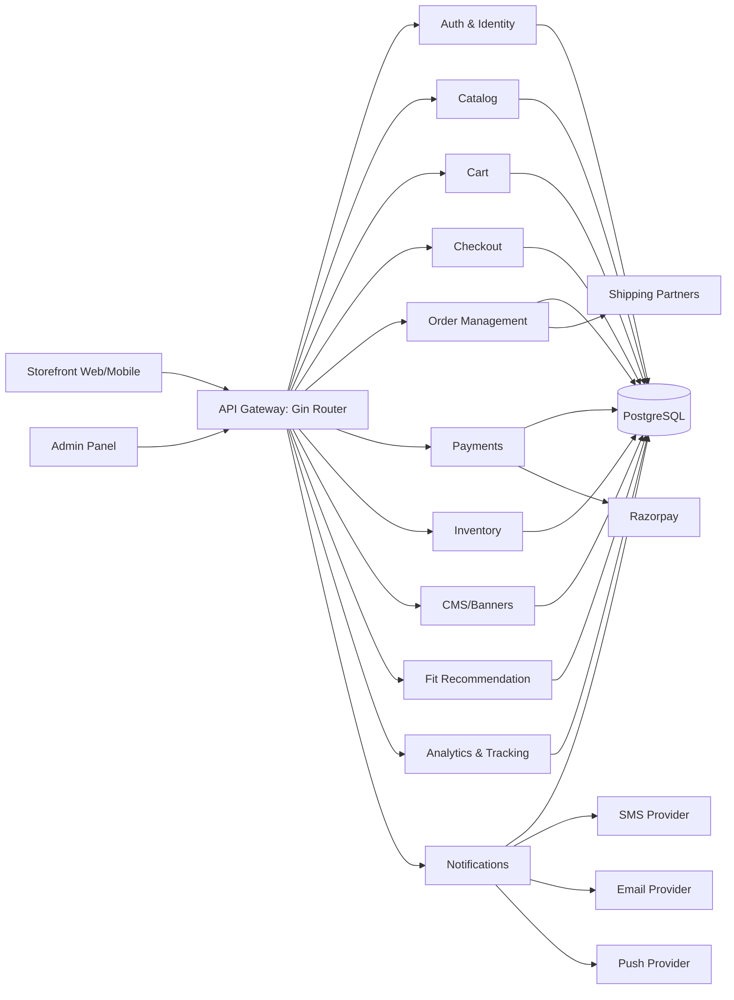

## 2. Auth and Identity

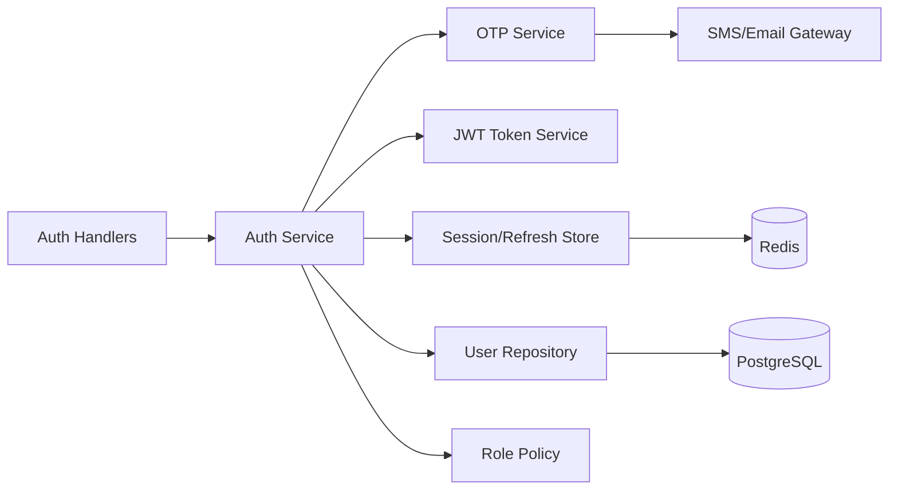

## 3. Catalog and Product Data

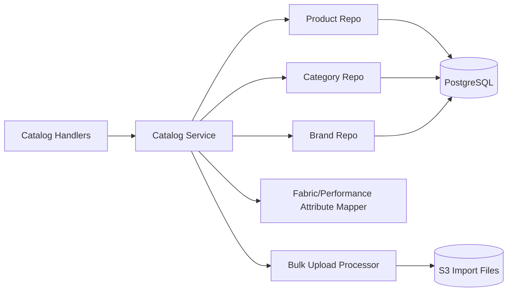

## 4. Cart and Checkout

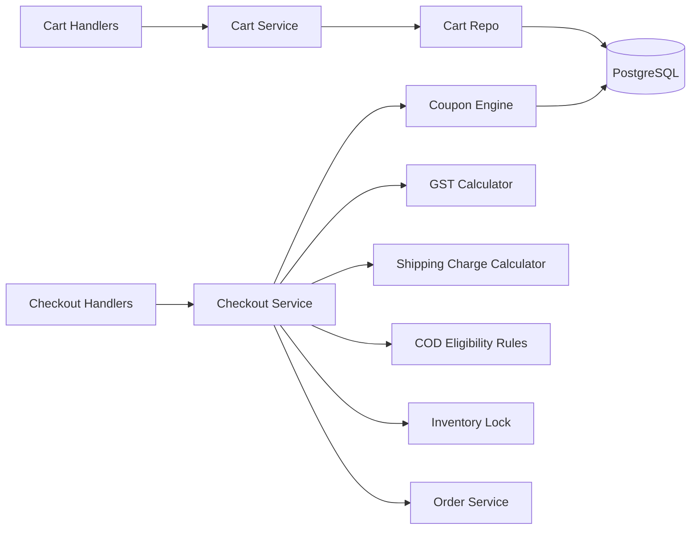

## 5. Orders, Shipping, Returns and Refunds

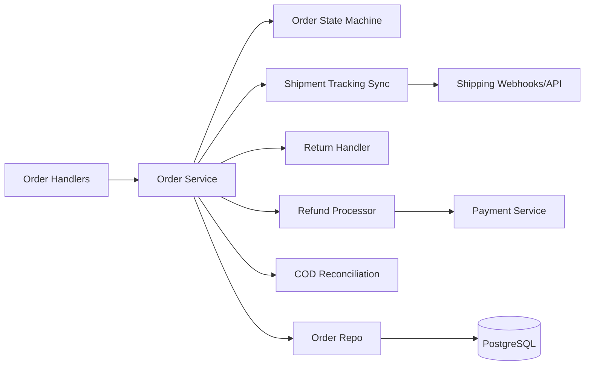

## 6. Payments

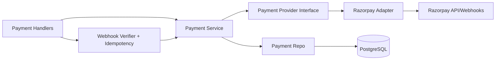

## 7. Inventory

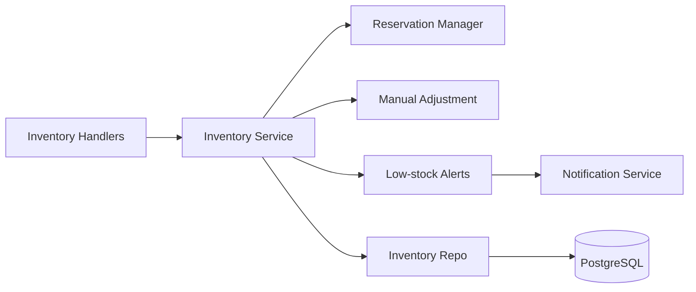

## 8. Fit Recommendation Engine (Phase 1)

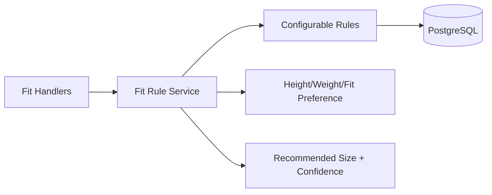

## 9. Admin and CMS

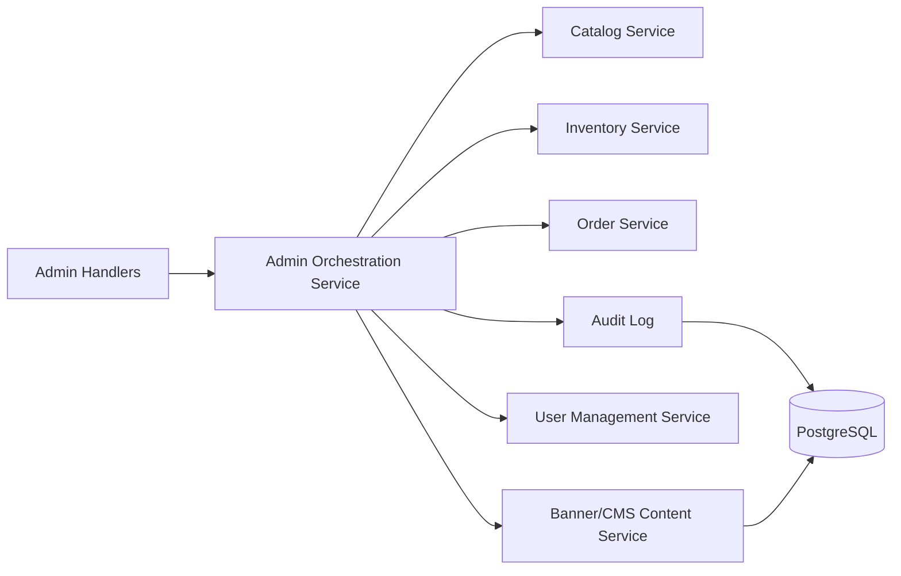

## 10. Analytics and Event Tracking

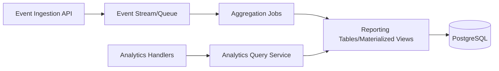

## 11. Notifications

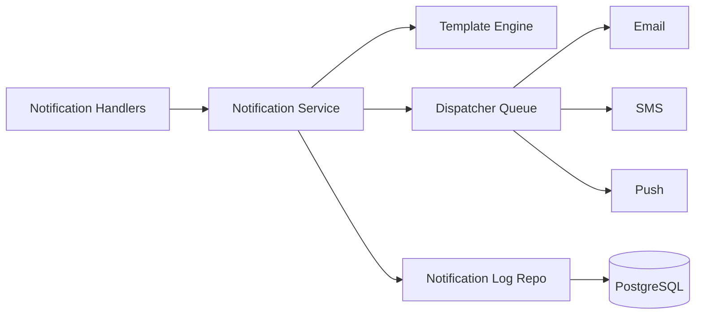

## 12. Infrastructure Topology

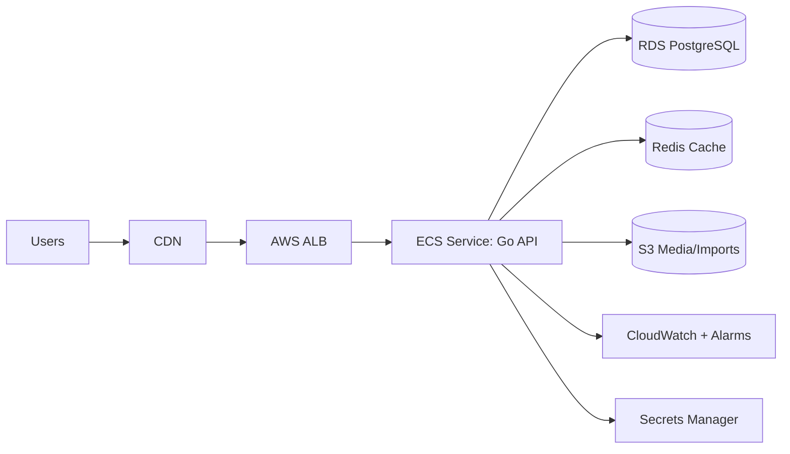

## 13. Cross-Cutting Requirements
- Environments: Development, Staging, Production.
- Security: SSL/TLS, secrets management, API rate limiting, WAF/firewall.
- Reliability: retries, idempotency keys, webhook signature checks.
- Operations: centralized logs, error tracking, SLO alerts, rollback runbook.
- Backup/DR: automated backups, retention policy, periodic restore tests.

